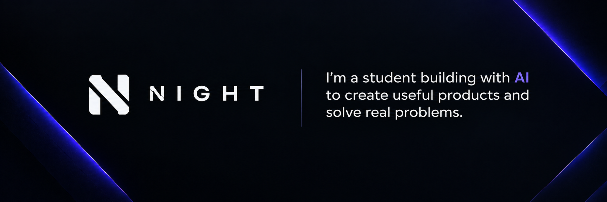
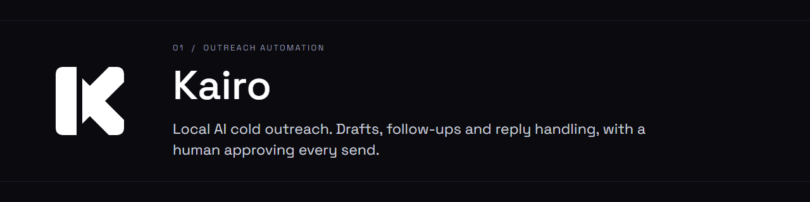
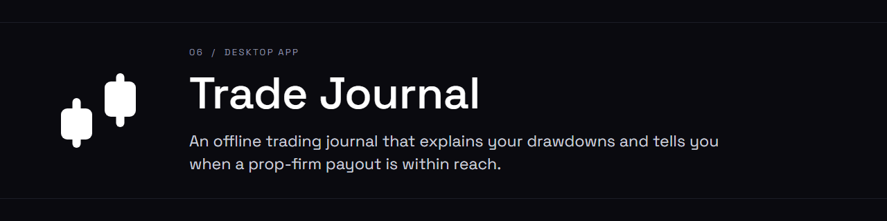

Hi, I'm Night. I'm a student who builds software with AI.

I've been using AI for about four years. At first I just used it. Then I wanted to know why it
works when it works and why it fails when it fails, and I've been digging into that ever since:
how prompts shape the output, which models are good at which jobs, what benchmarks tell you and
what they leave out, how much reasoning effort a task needs, and why a model gets worse as its
context fills up.

## Projects

| | |
|---|---|
| **Problem** | Cold outreach is hours of sending, following up, reading replies and booking calls, and most tools want your lead list on their server. |
| **Approach** | A Windows app that reads leads from an Excel file and sends through your own Gmail. Claude only sorts the replies and drafts answers. Nothing goes out until you click approve. |
| **Result** | A one-click installer, with 400+ tests that run on every push. |

| | |
|---|---|
| **Problem** | Prop-firm traders need to know why they're losing and when they can get paid. Spreadsheets can't answer that, and most journals upload your trades to a subscription service. |
| **Approach** | An offline desktop app with one local database. It splits losses into drawdown episodes, replays your real trading days against Apex and Lucid rules, and flags when you're payout-eligible. |
| **Result** | Version 1.3.3, built with [@mateitodirel](https://github.com/mateitodirel). |

| | |
|---|---|
| **Problem** | Four supermarket leaflets a week, and the deals site I planned to use had shut down. |
| **Approach** | I found the API behind another deals site, wrote the plan as five decision records, had one model build it and a different model review it. The review caught five real bugs, including a search that missed half of each store's offers. |
| **Result** | A Telegram message every morning with the deals on my shopping list, out of about 1,100 offers. |

**Tools for AI coding:**
[pdf-craft](https://github.com/Nightdreams-bat/pdf-craft) makes AI-generated PDFs look designed.
[claude-code-kit](https://github.com/Nightdreams-bat/claude-code-kit) is the Claude Code setup I use every day.
[claude-skills](https://github.com/Nightdreams-bat/claude-skills) has 17 skills you can copy one at a time.

## What I've learned

| Concept | What I do about it |
|---|---|
| Context windows | Useful context is much smaller than the advertised limit, so I keep sessions short and restart from notes. |
| CLAUDE.md | It loads on every turn, so it stays small. Situational rules go in skills that load only when needed. |
| Subagents | Each one gets a clean context, so exploration doesn't clutter mine, and cheap work can go to a cheaper model. |
| ADRs | I write down why each decision was made. Code can be rebuilt from a spec; the reasons can't. |
| Review | A different model reviews the code, because the model that wrote it shares its own blind spots. |

If something in one of these repos is broken or unclear, open an issue.
