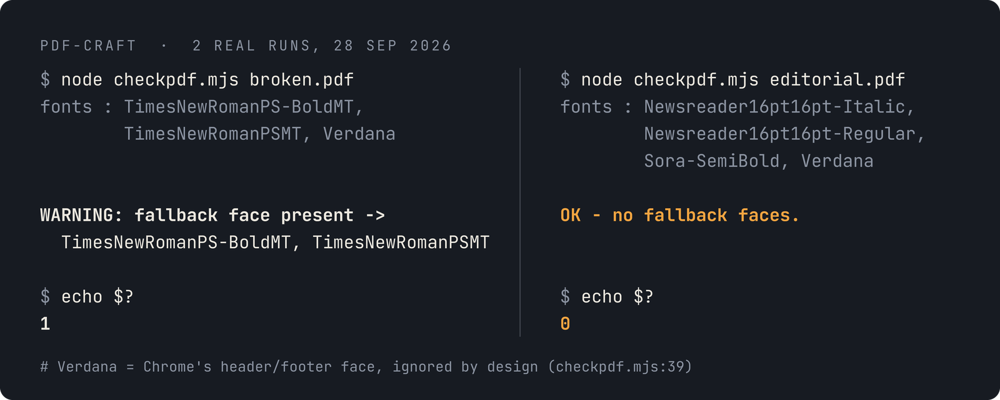

<picture>
  <source media="(max-width: 600px)" srcset="assets/banner_mobile.png">
  
</picture>

I'm Night. I build AI agents, test them, and open-source them as Nightdreams.
Some run on a schedule, unattended. What I learn from them goes into the lab notes.

Lab notes on X: [@nightdreamsbat](https://x.com/nightdreamsbat) · Latest: [my Claude Code setup, in 4 posts](https://x.com/nightdreamsbat/status/2104465285264851182)

### Agent tooling

- **[claude-code-kit](https://github.com/Nightdreams-bat/claude-code-kit)** · 25 skills, 25 slash commands, 7 subagents. The Claude Code setup I use every day, plus a script that runs several agents at once in separate git worktrees.
- **[claude-skills](https://github.com/Nightdreams-bat/claude-skills)** · 17 of the kit's skills as single folders you can copy one at a time.
- **[pdf-craft](https://github.com/Nightdreams-bat/pdf-craft)** · PDFs that don't look AI-made. The agent picks a layout and fonts before it writes, and a checker fails the build if a font falls back to Times:

<picture>
  <source media="(max-width: 600px)" srcset="assets/proof_mobile.png">
  
</picture>

### Also built

- **[zpd-learning](https://github.com/Nightdreams-bat/zpd-learning)** · 5 skills that teach at the edge of what you know. An adaptive test finds the edge, an Obsidian vault keeps the learner model, and `/tutor` drills the gaps.
- **[supermarket-deals](https://github.com/Nightdreams-bat/supermarket-deals)** · About 1,100 offers from four local supermarkets, checked every morning at 08:00. The ones on my shopping list go to Telegram.
